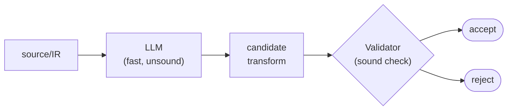

# LLMs in Compiler Construction

## Recap and Plan

In Part 1 we saw **DL compilers**---compilers built *for* deep learning workloads.

In Part 2 we flip the question:

> Q: What if a deep-learning model is *part of the compiler itself?*

Two themes today:

1. Where LLMs already plug into the classical compiler pipeline.
1. What can break---and what we, as compiler people, should do about it.

## A One-Slide LLM Refresher

For students who haven't seen Foundation Models yet:

- A **Large Language Model** (LLM) is a transformer trained on massive text corpora.
- It maps a sequence of tokens to a probability distribution over the *next* token.
- **Code LLMs** are trained (or fine-tuned) on source code: Codex, Code Llama, StarCoder, DeepSeek-Coder, Qwen-Coder.
- LLMs *generate* by sampling. They do not *prove*.

> Keep that last point. It will haunt us for the rest of the lecture.

## Two Directions: A Map

LLMs and compilers can interact in two opposite directions.

:::::::::::::: {.columns}
::: {.column width="50%"}

### LLM as User of the Compiler

- Codex, Copilot, ChatGPT writing source code.
- The output must *parse, type-check, and run*.
- The compiler is the oracle.

:::
::: {.column width="50%"}

### LLM Inside the Compiler

**Optimization:**

- Phase/pass ordering.
- Autotuning.
- IR-to-IR rewriting.

**Reverse engineering and testing:**

- Decompilation.
- Front-end fuzzing.

:::
::::::::::::::

Today we focus on the right-hand side---LLMs *as compiler components*.

## Why Even Try?

Classical compiler optimizations rely on:

- **Hand-engineered heuristics** (e.g., LLVM `O2` pipeline).
- **Cost models** that need constant tuning.
- **Hard search problems** (phase ordering, register allocation, autotuning).

LLMs are good at:

- Pattern recognition over huge corpora of code.
- Sequence-to-sequence translation.
- Generalizing across domains.

> Q: Where in the classical pipeline is "search and pattern match" the bottleneck?

## A Brief Pre-LLM History

Machine learning in compilers is *not* new.

- 2000s: ML-based inlining and unrolling heuristics.
- **MILEPOST GCC** (2008): replace hand-tuned heuristics with learned ones.
- **CompilerGym** (Facebook, 2021): RL environment for compiler optimization [@cgym].
- **AutoTVM/Ansor**: ML-driven autotuning of DL kernels.

> LLMs are the next chapter, not the first one.

## Where LLMs Plug In: A Survey

Six places along the pipeline where LLMs are being applied [@survey]:

1. **Source-level rewriting** (idiomatic, vectorizable, parallelizable).
1. **Pass/phase ordering** (which optimizations, in what order).
1. **IR-level transformation** (LLVM IR $\to$ better LLVM IR).
1. **Code generation** (LLVM IR $\to$ assembly).
1. **Autotuning** (search the schedule space).
1. **Decompilation** (assembly $\to$ source).

We will look at four of these in depth.

## (1) Source-Level Rewriting

LLMs as a *very* aggressive peephole optimizer at the source level. *(In SE terms: this is **refactoring**---behavior-preserving source-to-source transformation. Same activity, different community vocabulary. We come back to this later.)*

- Suggest vectorizable rewrites.
- Suggest parallel patterns (OpenMP pragmas, GPU kernels).
- Suggest idiomatic standard-library calls.

```c
// Before
for (int i = 0; i < n; i++) sum += a[i] * b[i];

// LLM suggestion
double sum = std::inner_product(a, a+n, b, 0.0);
```

> Q: What is the verification problem here?

## (2) Pass/Phase Ordering

A classic NP-hard search:

- LLVM has **over 100** optimization passes (the count varies by version; phase-ordering papers typically work over a curated subset of ~50--130).
- Their order matters; `-O3` (the standard "all optimizations on" preset) is one fixed point in a huge space.
- Best order can vary per program.

LLMs predict (or generate) good pass sequences:

- Fine-tune on (program, best-known sequence) pairs.
- Often beat `-O3` by a few percent on code size or runtime.

> Compare with CompilerGym's RL approach: same problem, different tool.

## (3) IR-Level Transformation

Train an LLM to map LLVM IR $\to$ optimized LLVM IR.

- Treat the IR as a token sequence.
- Train on `(unoptimized IR, -O3 IR)` pairs.
- Predict the optimized IR directly.

This is the headline result of **Meta's LLM Compiler**, our deep dive.

## Deep Dive: Meta's LLM Compiler---What It Is

We've previewed the categories. Now a concrete instance.

Meta released **LLM Compiler** in mid-2024 [@llmc]:

- Built on top of Code Llama.
- 7B and 13B parameter sizes, openly available on Hugging Face.
- Specifically pretrained on **546 billion tokens** of LLVM IR + assembly.
- Then instruction-tuned for compiler tasks.

## What It Does

Two main fine-tuned variants:

### Optimization Variant

- Input: an LLVM IR module.
- Output: an optimized LLVM IR module *and* a predicted code-size reduction.

### Disassembly Variant

- Input: x86_64 or ARM assembly.
- Output: corresponding LLVM IR.

> One model, two directions: optimization *and* reverse engineering.

## How Well Does It Work?

Reported results on the paper's benchmarks:

- **77%** of the optimization potential of an autotuner search---*without doing the search*.
- **45%** disassembly round-trip success.
- **14%** exact-match disassembly.

These numbers are remarkable, but they are *not 100%*.

> Q: For a compiler, is "77% of the autotuner" amazing or unusable?

## The Catch: Correctness

The paper is careful: LLM Compiler can **emit incorrect IR**.

- An LLM is trained to predict *plausible* IR, not *equivalent* IR.
- A 1-bit error in a 1000-token output is still a wrong program.
- Naive use without verification is dangerous.

The paper's recommendation: use the LLM as a *proposer*, then validate with a real compiler/equivalence checker.

> A compiler must be **correct first, fast second**. LLMs invert that.

## Pattern: "LLM Proposes, Compiler Disposes"

Stepping back from Meta LLM Compiler [@llmc]: what it does is one instance of the dominant safe pattern across LLM-for-compiler papers more generally:



Roles:

- **LLM**: a *fast, unsound* proposer. Generates plausible candidates from a huge corpus prior.
- **Validator**: a *slow, sound* gate. A real compiler, equivalence checker, or static analysis.

> Q: Where have we seen "propose-then-verify" in classical compiler work?

## Recall From Part 1

For a single GPU kernel, the schedule space had thousands of valid implementations.

Classical approaches:

- AutoTVM (boosted trees + simulated annealing).
- Ansor (evolutionary search + cost model).
- All of them: *very* compute-hungry.

## LLM-Driven Autotuning

LLMs can serve as a *prior* over good schedules:

- Prompt with a kernel + target hardware.
- Ask for a candidate schedule.
- Plug into the existing search loop.

Effect:

- Drastically fewer search iterations.
- Sometimes find schedules a classical search wouldn't reach.
- Same correctness story: validate every proposal.

> Same propose-then-verify pattern as IR rewriting.

## Why Decompile?

So far Part 2 has covered **forward** uses of LLMs in compilers---generating, transforming, and tuning code. Decompilation is a *backward* use: recovering source from a binary you've already compiled.

- Reverse engineering.
- Security: malware analysis, vulnerability finding.
- Legacy software.
- Recovering source from accidentally-only-binary releases.

Traditional decompilers (Ghidra, IDA, Hex-Rays) use static analysis + heuristics. They produce *compilable but ugly* C, often missing types and idioms.

## LLM4Decompile

LLM4Decompile [@llm4d] is the leading open-source LLM decompiler.

- Models from 1.3B to 33B parameters.
- Trained on `(assembly, source)` pairs.
- Targets x86_64 and ARM.
- Handles `-O0` through `-O3` (optimized binaries are *much* harder).

### Performance

- V1.5 (May 2024): >100% improvement over previous version on re-executable code.
- Larger models markedly better at long-range control/data flow.

## SLaDe and Friends

- **SLaDe** [@slade]: small transformer decompiler with strong results.
- **DecLLM** [@decllm]: focuses on producing *recompilable* output.
- **Idioms** [@idioms]: jointly predicts code and *type definitions* (a classic decompiler weakness).

> Decompilation is one place where LLMs are obviously the right tool: the task is fundamentally *fuzzy*.

## Hallucination Failure Mode

Decompiler hallucinations are sneaky:

- The output *looks* plausible.
- It *compiles* and runs.
- It does *not* match the binary's semantics.

> Q: How would you tell?

Mitigations:

- Re-compile the LLM output and diff against the original binary.
- Run the original and the recovered binary on the same inputs.
- Use the LLM only as a *renaming/commenting* layer over a classical decompiler.

## Compilers Have Bugs

Beyond optimization and decompilation, LLMs help with a third compiler-adjacent task: *finding bugs in compilers themselves*.

Csmith [@csmith] famously found *hundreds* of bugs in mainline GCC and Clang by random differential testing.

LLM-based fuzzers extend this:

- Prompt an LLM to generate "weird but legal" C/Python/TF programs.
- Run on multiple compilers/framework versions.
- Diff outputs.

The "weird-but-legal" + differential-test methodology *predates* LLMs by years: Daniel et al. used it (with random program generation, not LLMs) to find correctness bugs in **refactoring engines** in 2007 [@daniel2007]---the same engines our research builds on. LLMs are the modern program-generator slot in an older testing pattern. Applying LLMs to *refactoring-engine* testing specifically is a natural open direction.

> LLMs are *especially good* at generating syntactically tricky-but-valid programs.

## DL Compilers Have More Bugs

Tying back to Part 1: DL compilers are young and brittle. Four well-documented categories:

- **Silent miscompilation**: graph mode and eager mode disagree on the output. Caused by `torch.compile` graph breaks discarding side effects, or `tf.function` retracing under inputs the original trace didn't see.
- **Numerical drift**: aggressive operator fusion reorders floating-point operations, returning different values---especially visible at `fp16`/`bf16`.
- **Crashes**: the tracer fails on specific Python constructs, dynamic shapes, or unsupported control flow.
- **Retrace thrashing**: shape or dtype variations trigger expensive recompilation, sometimes invisibly---a *performance* bug that masquerades as "the model is slow."

LLM-based fuzzing has recently surfaced hundreds of such bugs in DL frameworks [@dlfuzz].

> Q: How does this connect to *concept drift* and *technical debt* in ML systems?

## What LLMs Cannot Do (Yet)

- **Prove** semantic equivalence.
- **Guarantee** termination.
- **Reason** about resource bounds (memory, time, FLOPs).
- **Handle** truly novel architectures (training data didn't see them).

A compiler that misoptimizes 1 in 1000 programs is **broken**. A code assistant that misanswers 1 in 1000 questions is *good*.

> The bar for *compilers* is higher than the bar for *assistants*.

## Verification Gap

This is the central research challenge.

```
   LLM output  ----?---->  trustworthy compilation
```

Approaches under active research:

1. **Translation validation**: per-compilation equivalence checking.
1. **Bounded model checking** of LLM outputs.
1. **Type-directed prompting**: constrain LLMs with rich types.
1. **Sketch-and-fill**: LLM proposes; symbolic engine fills holes; verifier checks.

## Connection to This Course's Toolkit

The course toolkit gives you most of what you need to verify LLM output:

- Lexing/parsing $\to$ check the LLM produced syntactically valid IR.
- Type checking $\to$ check it preserves types.
- Dataflow analysis $\to$ check it preserves variable definitions and uses.

The missing piece---and the heart of the **verification gap**---is *equivalence checking*: proving an LLM's transformed output computes the same function as its input. We didn't cover formal equivalence checking this semester, but the foundations above are exactly what you build on top of.

> The verifier is what makes the LLM safe to use. **Compilers people are exactly the right people to build it.**

## Aside: LLMs and Refactoring

Refactoring is a *behavior-preserving program transformation*---exactly the same correctness story as a compiler optimization, just at the source level.

So *of course* people are trying LLMs.

- StarCoder2 (an open-source code LLM from BigCode) reduced code smells **20.1%** more than human developers in a controlled study [@llmref1].
- ChatGPT identified **15.6%** of refactoring opportunities zero-shot, but **86.7%** with task-specific prompting [@llmref2].
- A 2025 systematic review covers >100 papers in this area [@llmref3].

> Q: Recall the slide on LLM hallucination in decompilation. What's the analog for LLM refactoring?

## Connecting Back to Our Research

Our work on safe refactoring of imperative DL programs occupies the *verifier* half of the pattern: static analysis checks refactoring preconditions and rejects unsafe transformations [@kh23; @kh25]. The "proposer" today is a set of simple heuristics (decorator placement, function naming, library imports), not an LLM---which is why the next slide invites you to think about replacing the heuristic proposer with one.

## Refactoring: Preconditions and Results

:::::::::::::: {.columns}
::: {.column width="50%"}

### What the Preconditions Check

- No graph-incompatible side effects.
- Tensor flow matches expected shape/dtype/device.
- Control flow is graph-tractable.
- Decorator placement is consistent.

Preconditions filter candidates; we then *empirically* validate the surviving refactorings against runtime benchmarks and model accuracy. We do not formally prove semantic equivalence.

:::
::: {.column width="50%"}

### What It Bought Us

- 326/766 candidate functions (**42.56%**) refactorable.
- **2.16x** average speedup on performance tests.
- Negligible accuracy loss.
- Evaluated on 19 real DL projects (132 KLOC) [@kh25].

:::
::::::::::::::

> An LLM proposing this same rewrite directly---no precondition check, no empirical evaluation pipeline---offers no signal that your model still works.

## A Research Opportunity (Open Invitation)

The unsolved problem in this space:

> Can an LLM **propose** more refactoring candidates than today's heuristics, with **static-analysis preconditions** filtering out unsafe ones and the empirical-evaluation pipeline (benchmarks, accuracy) catching what the analysis misses?

This is a natural PhD/Master's project that would combine:

- The static-analysis material from this course.
- The LLM-augmentation patterns we just covered.
- DL compiler integration.

If this interests you, please come talk to me. NSF supports this line of work (awards CCF-22-00343 and CNS-22-13763).

## Discussion: Where Do You Trust LLMs?

For each of the following compiler tasks, is an LLM "compiler-grade" trustworthy today?

| Task                              | Trust?     |
|-----------------------------------|------------|
| Suggest a faster algorithm        |            |
| Reorder LLVM passes               |            |
| Translate IR $\to$ optimized IR   |            |
| Generate a fuzzing input          |            |
| Decompile a malware sample        |            |
| Replace standard compiler optimizations | |
| Refactor eager DL code to graphs  |            |

> Discuss in pairs. We'll go through the table together.

## A Working Mental Model

|                | **LLM (Proposer)**       | **Verifier**          |
|----------------|--------------------------|-----------------------|
| What it gives  | A good prior over outputs| A sound check         |
| Speed          | Fast                     | Slow                  |
| Soundness      | Unsound                  | Sound                 |
| Solves         | Search                   | Correctness           |

- LLMs solve the **search problem**.
- Compiler theory solves the **soundness problem**.
- Together, they cover what neither can alone.

## What You Learned This Semester

1. **Introduction**: implementation methods, the toolchain.
1. **Lexical analysis**: regex, finite automata, JFlex.
1. **Syntax analysis**: grammars, LL(1)/LR(1), CUP.
1. **Type checking**: attribute grammars, type constraints.
1. **Intermediate code**: ASTs, DAGs, three-address code.
1. **Control-flow analysis**: CFGs, dominators, loops, control dependences.
1. **Data-flow analysis**: reaching definitions, lattices, fixed-point.
1. **Compiler optimizations**: local, global, and loop transformations (fusion, peeling, unrolling, code motion); copy propagation.
1. **Today**: where this toolkit meets the modern frontier---DL compilers and LLM-augmented compilation.

## Final Take-Home Points

1. LLMs are now part of the compiler-construction toolbox---as proposers, not as oracles.
1. Meta's **LLM Compiler** shows you can pretrain a foundation model directly on IR.
1. **Decompilation** is the most natural fit; correctness must still be checked.
1. The hard problem is the **verification gap**---and it is *exactly* the kind of problem this course prepared you for.
1. The frontier of compilers is being defined right now. **You are equipped to contribute.**

## Reading

The Dragon Book does not cover this material. Use these instead.

### Required (Pick One)

- Cummins et al. *Meta Large Language Model Compiler.* 2024. [arxiv.org/abs/2407.02524](https://arxiv.org/abs/2407.02524)---a foundation model trained on 546B tokens of LLVM IR + assembly.
- Gao et al. *Language Models for Code Optimization: Survey, Challenges and Future Directions.* 2025. [arxiv.org/abs/2501.01277](https://arxiv.org/abs/2501.01277)---a recent survey of where LLMs sit in the compiler pipeline.

### Strongly Recommended

- Tan et al. *LLM4Decompile: Decompiling Binary Code with LLMs.* EMNLP 2024. [arxiv.org/abs/2403.05286](https://arxiv.org/abs/2403.05286)
- Cummins et al. *CompilerGym.* CGO 2022.
- Yang et al. *Finding and Understanding Bugs in C Compilers (Csmith).* PLDI 2011.
- Deng et al. *LLMs are Edge-Case Generators (DL framework fuzzing).* ICSE 2024.

### LLMs in Refactoring (Related Field, Optional)

- Liu et al. *Empirical Study on the Code Refactoring Capability of LLMs.* 2024. [arxiv.org/abs/2411.02320](https://arxiv.org/abs/2411.02320)
- *Software Refactoring Research with LLMs: A Systematic Literature Review.* JSS 2025.

## References

::: {#refs}
:::

## Optional Take-Home (After Quiz 2)

For anyone who wants to keep going after Quiz 2:

- Pick **one paper** from the References slides---Part 1 or Part 2 *(or email me first to propose a paper outside the References)*.
- Read it.
- Write a **one-page response**: what does it claim, what did you find compelling or unconvincing, where does it connect to the rest of this course?
- Email it to me by the last day of the semester.

> **Voluntary.** No grade impact either way. Quiz 2 prep first; this is for *after*.

## Thank You

> Compilers are not a solved problem. They are *the* problem at the boundary of every new computational platform---deep learning yesterday, neural-symbolic systems tomorrow.

Have a great summer.
